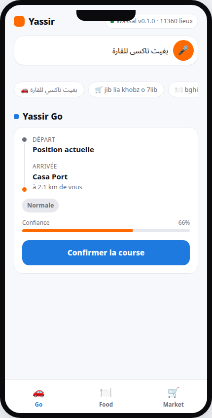

# Wassal - وصّل

**Assistant vocal en Darija pour Yassir.** You say *"بغيت تاكسي للقارة"* and Wassal returns a structured request that Yassir can execute.

> Candidature **Yassir AI for Everyday Impact** (Maroc) : rendre Yassir accessible aux personnes qui parlent Darija mais lisent ou tapent difficilement.

```
 🎙️ audio Darija ──► MoulSot v0.3 (ASR) ──► texte ──► parser (intention) ──► landmarks (GPS) ──► JSON Yassir
                                         ▲
                     texte Darija ───────┘
```

| Entrée | Sortie |
|---|---|
| `بغيت تاكسي للقارة` (Casablanca) | **Yassir Go** → Gare Casa-Voyageurs `33.5894, -7.5906` |
| `jib lia khobz o 7lib` | **Yassir Market**, items `["bread", "milk"]` |
| `bghit tajine mn resto fasa` | **Yassir Food**, items `["tajine"]`, urgence `urgent` |
| `taxi derrière la mosquée` + position GPS | **Yassir Go** → *derrière* la mosquée réelle la plus proche (ex. Mosquée Al Andalous, à 487 m) |

Les services suivent l'offre de Yassir au Maroc : Go (VTC), Food (restaurants) et Market (courses). La livraison de colis est détectée, mais signalée comme hors de cette offre.

Les adresses sont résolues sur **de vrais lieux** : **11 352 lieux OpenStreetMap** (mosquées, pharmacies, gares, banques, hanouts, tram…) à Casablanca, Fès et Marrakech, plus 8 grands repères vérifiés à la main. « La mosquée » désigne la mosquée réelle la plus proche de l'utilisateur. Aucune donnée n'est inventée.

📖 Explication détaillée, exemples réels et limites : [docs/COMMENT_CA_MARCHE.md](docs/COMMENT_CA_MARCHE.md)

## Aperçu : intégration dans l'app Yassir

Wassal n'est pas pensé comme une appli à part : c'est un bouton vocal/texte au-dessus des écrans **Go / Food / Market** qui existent déjà dans l'app Yassir. On parle ou on tape une commande en Darija, l'intention est détectée automatiquement, et l'app bascule directement sur l'onglet et l'écran de commande déjà pré-remplis (destination, articles…) — il ne reste qu'à confirmer.



*`frontend/index.html` sert ce POC mobile (voix + texte, 3 onglets, dispatch simulé) pour démontrer l'idée d'intégration à l'équipe — pas un client mobile natif.*

---

## Démarrage rapide

**Python 3.9+** (testé sur 3.13). Aucune version de Python n'est bloquée : `qwen-asr` tire lui-même les versions de `torch`/`transformers`/`accelerate` compatibles avec votre interpréteur.

```bash
# Windows
python -m venv .venv
.venv\Scripts\activate

# macOS / Linux
python3 -m venv .venv
source .venv/bin/activate

pip install -r requirements.txt
cp .env.example .env          # Windows : copy .env.example .env
python src/api.py
```

> ⚠️ **Installation lourde (~1-2 Go)** : `qwen-asr` (le loader officiel de MoulSot) entraîne `torch`, `transformers`, `accelerate` et `gradio`. Si vous testez uniquement le parsing de texte et les adresses (pas l'audio), vous pouvez ignorer cette étape et installer seulement `flask flask-cors python-dotenv requests pytest` — `src/api.py` démarre quand même, et `/wassal/command` en JSON texte fonctionne normalement ; seul l'upload audio renverra `MODEL_UNAVAILABLE`.

Ouvrir **http://localhost:5000** pour l'interface web, ou appeler l'API directement :

```bash
curl -X POST http://localhost:5000/wassal/command \
  -H "Content-Type: application/json" \
  -d '{"darija_text": "bghit taxi l jemaa el fna daba", "city": "marrakech", "phone": "0612345678"}'
```

Tests (sans télécharger le modèle, en quelques secondes) :

```bash
pytest -v
```

**Mise en ligne :**
- **Gratuit, sans la voix :** Render, voir [docs/DEPLOIEMENT_RENDER.md](docs/DEPLOIEMENT_RENDER.md). C'est la version partagée avec l'équipe et le jury.
- **Avec la voix :** Hugging Face Spaces, qui demande l'abonnement PRO, voir [docs/DEPLOIEMENT_HUGGINGFACE.md](docs/DEPLOIEMENT_HUGGINGFACE.md).

> Le modèle MoulSot est téléchargé depuis HuggingFace **au premier envoi audio**, pas au démarrage. Mettez `PRELOAD_MODEL=true` pour le charger au lancement. Formats acceptés : wav, flac, ogg, mp3, m4a, aac, webm, opus, mp4. Les formats compressés sont décodés avec PyAV, qui embarque ffmpeg : aucune installation système nécessaire.

---

## Structure

```
wassal/
├── src/
│   ├── transcribe.py   # MoulSot v0.3 : audio -> texte (chargement paresseux, thread-safe)
│   ├── parser.py       # Texte Darija -> service, sous-type, urgence, articles, confiance
│   ├── landmarks.py    # Lieux réels -> GPS : par nom ou "le plus proche", relations, crowdsourcing
│   ├── categories.py   # Catégories de lieux : mots Darija <-> tags OpenStreetMap
│   ├── normalize.py    # Normalisation arabe / arabizi / français partagée
│   └── api.py          # Serveur Flask (CORS, validation, erreurs JSON standardisées)
├── frontend/index.html # POC mobile (onglets Go/Food/Market, voix+texte) — servie sur /
├── docs/COMMENT_CA_MARCHE.md  # Fonctionnement détaillé + limites + mesures à faire
├── data/osm/           # Vrais lieux OpenStreetMap (ODbL), un fichier par ville
├── scripts/import_osm.py  # Réimporte data/osm/ depuis OpenStreetMap
├── tests/fixtures/osm/ # Extrait réel de data/osm/ pour des tests rapides
├── tests/test_commands.py
├── deploy/huggingface/ # Space Hugging Face (Docker, avec la voix)
├── render.yaml         # Déploiement Render gratuit (sans la voix)
├── .env.example
├── requirements.txt         # Tout, voix comprise
└── requirements-server.txt  # Hébergement léger, sans la voix
```

---

## API

Toutes les réponses suivent la même enveloppe :

```jsonc
// succès
{ "success": true,  "request_id": "a1b2c3d4e5f6", "processing_ms": 3, "data": { ... } }
// erreur
{ "success": false, "request_id": "a1b2c3d4e5f6", "error": { "code": "INVALID_PHONE", "message": "...", "details": {} } }
```

### `GET /wassal/test`

Health check : version, état du modèle ASR, nombre de repères, villes supportées.

### `POST /wassal/command`

**JSON**

```json
{ "darija_text": "taxi derrière la mosquée", "city": "casablanca", "phone": "0612345678",
  "user_lat": 33.5870, "user_lng": -7.6300 }
```

**ou multipart/form-data** avec un fichier `audio` (+ `city`, `phone`) : l'audio est transcrit par MoulSot puis traité comme du texte.

| Champ | Requis | Notes |
|---|---|---|
| `darija_text` | oui (sauf si `audio`) | 500 caractères max ; arabe, arabizi, français ou mélange |
| `city` | non | `casablanca`, `fes`, `marrakech` (accepte `Casa`, `فاس`, `Fès`…) |
| `phone` | non | Numéro marocain, normalisé en `+2126XXXXXXXX` |
| `user_lat`, `user_lng` | non, mais nécessaires pour « la mosquée », « lfarmasyan »… | Position GPS de l'utilisateur (au Maroc). Sert à trouver le lieu le plus proche, à déduire la ville et à remplir le point de départ |

Si un lieu est désigné par sa catégorie sans position, la réponse contient `missing_fields: ["user_location"]` et `unresolved_places` : l'app doit demander la position au lieu de deviner.

**Réponse (`data`)**

```json
{
  "service_type": "ride",
  "subtype": "taxi",
  "yassir_product": "Yassir Go",
  "destination": {
    "lat": 33.5894, "lng": -7.5906,
    "place": "Gare Casa-Voyageurs", "place_name": "Gare Casa-Voyageurs",
    "relation": null, "confidence": 0.95, "city": "casablanca"
  },
  "pickup": null,
  "items": [],
  "urgency": "normal",
  "confidence": 0.9,
  "confidence_breakdown": { "intent": 0.95, "destination": 0.95 },
  "ready_for_yassir": true,
  "missing_fields": [],
  "warnings": [],
  "language": "darija",
  "yassir_request": {
    "service": "ride", "category": "taxi", "product": "Yassir Go",
    "pickup":  { "type": "current_location" },
    "dropoff": { "type": "landmark", "lat": 33.5894, "lng": -7.5906, "label": "Gare Casa-Voyageurs" },
    "priority": "normal",
    "customer": { "phone": "+212612345678" },
    "source": "wassal_voice"
  }
}
```

`ready_for_yassir` est `true` quand le service est identifié, que les champs nécessaires sont présents (destination pour taxi/colis, articles ou destination pour Food/Market) et que la confiance dépasse `MIN_CONFIDENCE` (0.6 par défaut). Sinon, `missing_fields` et `warnings` expliquent pourquoi, pour que l'app puisse poser une question de relance.

`yassir_request` est le **contrat d'intégration proposé**. Il faudra l'aligner sur l'API partenaire de Yassir.

**Codes d'erreur :** `MISSING_TEXT`, `TEXT_TOO_LONG`, `INVALID_JSON`, `INVALID_CITY`, `INVALID_PHONE`, `INVALID_LOCATION`, `UNSUPPORTED_FORMAT`, `UNSUPPORTED_MEDIA_TYPE` (415), `PAYLOAD_TOO_LARGE` (413), `MODEL_UNAVAILABLE` (503), `NO_SPEECH` / `DECODE_ERROR` (422), `INTERNAL_ERROR` (500).

### `GET /wassal/landmarks?city=fes&category=pharmacy&source=osm&limit=50`

Liste les lieux connus. Tous les filtres sont optionnels. `source` vaut `curated`, `osm` ou `crowdsourced` ; `limit` va jusqu'à 1000 et vaut 200 par défaut.

### `POST /wassal/landmarks` (crowdsourcing)

```json
{ "name": "Café Atlas", "city": "casablanca", "lat": 33.59, "lng": -7.61, "aliases": ["9ahwa atlas", "قهوة أطلس"] }
```

Les coordonnées sont validées : elles doivent être au Maroc et à moins de 40 km du centre de la ville. Un repère crowdsourcé démarre à une confiance de 0.6, qui augmente de 0.05 à chaque nouvelle soumission identique, jusqu'à 0.8 maximum. Les repères curés restent à 0.95. Si `WASSAL_API_TOKEN` est défini, l'en-tête `X-API-Key` est exigé.

---

## Comment ça marche

### 1. Normalisation (`normalize.py`)

La Darija s'écrit de trois façons, souvent mélangées : alphabet arabe (`بغيت`), arabizi (`bghit`, avec `3/7/9` pour `ع/ح/ق`) et français (`la gare`). Avant tout matching, le texte est mis en minuscules, les accents et harakat sont retirés, et les variantes de lettres sont unifiées (`أ/إ/آ → ا`, `ة → ه`, `گ → ك`). Les mots-clés tolèrent aussi les préfixes collés : `ltaxi`, `للقارة`, `fljamaa`, `ldjamaa`.

### 2. Intention (`parser.py`)

Chaque service a un dictionnaire de mots-clés pondérés :

| Service | Produit Yassir | Poids 3 (explicite) | Indices (1 à 2) |
|---|---|---|---|
| `taxi` | Yassir Go | `taxi`, `تاكسي`, `درايفر` | `hezni`, `diini`, `waslni` |
| `food` | Yassir Food | `makla`, `ماكلة`, `resto`, `snack` | `ji3an`, `ghda`, `jib lia` |
| `market` | Yassir Market | `hanout`, `حانوت`, `courses`, `marjane` | `chri lia`, `souk`, `kolchi` |
| `package` | — | `colis`, `طرد`, `sift` | `wra9`, `7aja` |

Chaque article ajoute +2 à son service : les courses (`khobz`, `7lib`, `zit`…) vont vers Market, les plats (`pizza`, `tajine`, `harira`…) vers Food. Les boissons (`coca`, `jus`) ajoutent +1 aux deux.

La confiance combine la force du signal et l'écart avec le deuxième service. `waslni` seul veut dire "emmène-moi" (course), mais `waslni package` devient une livraison de colis.

Urgence : `fasa`, `daba`, `dlak`, `zerba`, `دغيا` → `urgent` ; `basr`, `bsr3a`, `vite` → `quick` ; sinon `normal`.

### 3. Adresses (`landmarks.py`, `categories.py`)

Les lieux viennent d'**OpenStreetMap** (`data/osm/`, 11 352 lieux) et de 8 grands repères vérifiés à la main.

- **Par nom :** `jamaa hassan 2`, `koutoubia`, `jamaa badr`. Les synonymes Darija sont générés à partir des noms OSM : « Mosquée Badr » se retrouve aussi avec `jamaa badr` ou `جامع بدر`.
- **Par catégorie :** `la mosquée`, `lfarmasyan`, `sbitar`, `7da bim`. On prend le lieu réel le plus proche de `user_lat` / `user_lng`. Sans position, rien n'est deviné : `missing_fields: ["user_location"]`. Seules « la gare » et « l'aéroport » ont un lieu par défaut par ville.
- **L'alias le plus long gagne :** `jemaa el fna` n'est pas confondu avec `jamaa`. Les mots de commande (`taxi`, `pizza`…) ne sont jamais pris pour des noms de lieux.
- **Relations spatiales :** `derrière` / `wra` / `مور` → `behind`, `7da` / `حدا` / `qrib` → `near`, `9dam` / `قدام` → `front`.
- **Départ et arrivée :** `mn lgare l jamaa hassan 2` donne `pickup` = gare et `destination` = Hassan II.

Mettre à jour les lieux : `python scripts/import_osm.py` (voir [data/osm/README.md](data/osm/README.md)).

### 4. Transcription (`transcribe.py`)

[MoulSot v0.3](https://huggingface.co/atlasia/moulsot.v0.3) (Apache 2.0, architecture Qwen3-ASR). Le modèle n'est pas encore reconnu par `transformers.pipeline()` : on utilise le loader officiel de sa fiche, le paquet `qwen_asr` (`Qwen3ASRModel.from_pretrained(...).transcribe(...)`). L’audio est décodé par Wassal (libsndfile, ou PyAV pour m4a/webm), converti en mono et passé au modèle en `(samples, sample_rate)`. La durée est limitée à `MAX_AUDIO_SECONDS`. `DEVICE=auto` choisit CUDA, MPS ou CPU. La fonction ne lève jamais d'exception : elle renvoie toujours `{status, transcription, language, ...}`.

> Le nom `01Yassine/moulsot.v0.3` (celui de l'énoncé initial) redirige vers le dépôt canonique `atlasia/moulsot.v0.3` sur HuggingFace ; c'est celui-ci qu'utilise `MOULSOT_MODEL` par défaut.

```bash
python src/transcribe.py commande.wav
```

---

## Configuration (`.env`)

| Variable | Défaut | Rôle |
|---|---|---|
| `YASSIR_API_KEY` | – | Clé partenaire Yassir (réservée, pas encore utilisée) |
| `FLASK_ENV` | `production` | `development` active le mode debug |
| `HOST` / `PORT` | `127.0.0.1` / `5000` | Adresse d'écoute |
| `MOULSOT_MODEL` | `atlasia/moulsot.v0.3` | Modèle HuggingFace |
| `DEVICE` | `auto` | `auto`, `cpu`, `cuda`, `mps` |
| `ASR_LANGUAGE` | `Arabic` | Langue passée à `qwen_asr` |
| `PRELOAD_MODEL` | `false` | Charger le modèle au démarrage |
| `MAX_AUDIO_SECONDS` | `60` | Durée audio max |
| `MIN_CONFIDENCE` | `0.6` | Seuil de `ready_for_yassir` |
| `LANDMARKS_STORE` | `data/crowdsourced_landmarks.json` | Stockage du crowdsourcing |
| `OSM_DATA_DIR` | `data/osm` | Lieux OpenStreetMap (vide = désactivé) |
| `WASSAL_API_TOKEN` | – | Protège `POST /wassal/landmarks` |
| `CORS_ORIGINS` | `*` | Origines autorisées |

---

## Ajouter des mots ou des repères

- **Nouveau mot Darija :** ajoutez-le dans `SERVICES`, `ITEMS` (+ `ITEM_CATEGORY`) ou `URGENCY` dans [src/parser.py](src/parser.py), puis un cas dans `tests/test_commands.py`.
- **Lieu manquant ou mal placé :** corrigez-le sur [openstreetmap.org](https://www.openstreetmap.org), puis relancez `python scripts/import_osm.py`.
- **Nouvelle catégorie** (ex. « la mahlaba ») : ajoutez-la dans `CATEGORIES` ([src/categories.py](src/categories.py)) avec ses mots Darija et son tag OSM, puis relancez l'import.
- **Nouvelle ville :** ajoutez-la dans `CITIES` ([src/landmarks.py](src/landmarks.py)) avec son centre, sa zone `bbox` et ses alias, puis relancez l'import.

## Limites connues et prochaines étapes

- Parser à base de mots-clés : explicable et rapide, mais il ne comprend pas les négations (`ma bghitch taxi`). Étape suivante : un classifieur léger fine-tuné sur des commandes réelles, en gardant le parser comme repli.
- La couverture OSM est inégale : beaucoup de hanouts et de mosquées de quartier manquent ou n'ont pas de nom. On peut les compléter sur OpenStreetMap ou via le crowdsourcing.
- « Derrière / à côté » est détecté, mais le point n'est pas encore décalé par rapport au repère.
- Pas d'envoi réel à Yassir : `yassir_request` est prêt, l'appel HTTP reste à brancher une fois la spec partenaire connue.
- Serveur de développement Flask : en production, utiliser `gunicorn "src.api:create_app()"` ou `waitress` sous Windows, avec un rate limiting.

## Licence

- Modèle MoulSot v0.3 : Apache 2.0.
- Lieux dans `data/osm/` : © contributeurs [OpenStreetMap](https://www.openstreetmap.org/copyright), licence ODbL 1.0. L'attribution est affichée dans l'interface.
- Code Wassal : à définir (ajouter un fichier `LICENSE`).

## Équipe

Projet réalisé en une journée lors du hackathon **GOMYCODE × NVIDIA « Build with Any AI »** (27 septembre 2026), candidature au prix **Yassir AI for Everyday Impact** (Maroc).

| Membre | Rôle |
|---|---|
| **Nassim Hsaine** | Chef d'équipe : choix du problème et du prix visé, coordination de l'équipe, recherche sur les modèles d'IA adaptés à la Darija, pitch et soumission du projet |
| **Oussama Bartil** | Cœur du produit : parser Darija, résolution des adresses sur OpenStreetMap, API Flask, transcription vocale MoulSot, déploiement Hugging Face |
| **Abdelkrim Bellagnech** | Expérience mobile : démonstration d'intégration Go / Food / Market, gestion des négations, simulation du dispatch |
